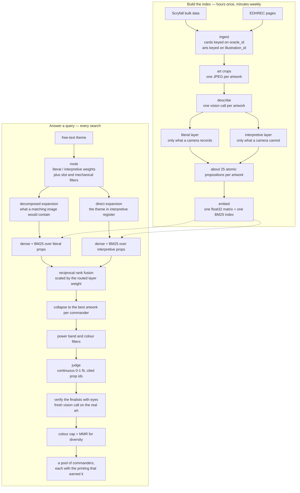
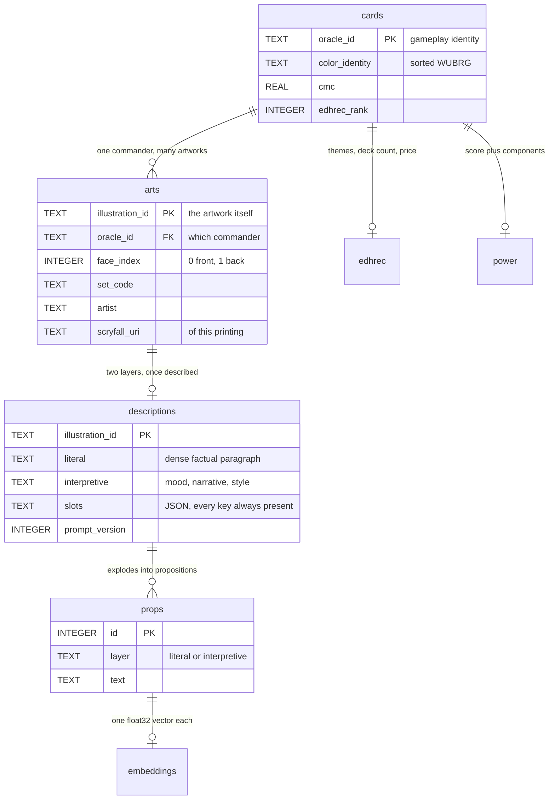

<div align="center">

<picture>
  <source media="(prefers-color-scheme: dark)" srcset="assets/logo-dark.svg">
  
</picture>

<h1>Scrying Pool</h1>

<p><b>Search Magic: The Gathering commanders by what their card art depicts, means, or evokes.</b></p>

<p><i>&ldquo;commanders with beards&rdquo; &nbsp;·&nbsp; &ldquo;a single figure against a huge empty background&rdquo; &nbsp;·&nbsp; &ldquo;commanders that look lonely&rdquo; &nbsp;·&nbsp; &ldquo;would fit on a black metal album cover&rdquo;</i></p>

<p>
  
  
  
  
  
  
</p>

<p>
  <a href="#the-theme-spectrum">Spectrum</a> &nbsp;·&nbsp;
  <a href="#an-example-search">Example</a> &nbsp;·&nbsp;
  <a href="#how-it-works">How it works</a> &nbsp;·&nbsp;
  <a href="#quickstart">Quickstart</a> &nbsp;·&nbsp;
  <a href="#command-reference">Commands</a> &nbsp;·&nbsp;
  <a href="#evaluation">Evaluation</a> &nbsp;·&nbsp;
  <a href="#known-limits">Limits</a>
</p>

🔮 &nbsp;Ollama + SQLite + numpy on your own machine. No cloud, no vector database, no framework.

</div>

---

> An artwork described as *"a hooded figure stands alone on a cliff at dusk, muted blues, no other figures"*
> contains every scrap of evidence for **lonely** and never once contains a word that embeds near it.

That sentence is the whole design. A single literal description layer cannot serve both ends of the theme
spectrum, so Scrying Pool gives every artwork **two descriptions with opposite epistemic rules**, and sends
every abstract query down **two independent retrieval routes**. Gameplay identity and artwork are modelled
separately, so a theme matches a specific *printing* — Atraxa has half a dozen wildly different arts, and only
one of them might be lonely.

---

## The theme spectrum

| Register | Ask it | How it finds them |
| :-- | :-- | :-- |
| **Literal** | `commanders with a full beard` | Routes ≈ 1.0 literal. A structured filter on the `primary_subject.facial_hair` slot, plus the literal propositions. The bearded villager standing behind the dragon is an *other figure*, so he never makes the dragon bearded. |
| **Literal, negated** | `commanders holding something that isn't a weapon` | Every held object is recorded with an `is_weapon` flag, so this becomes `held_objects contains "is_weapon":false` — a lantern, a book, an infant, a severed head. |
| **Compositional** | `a single small figure against a huge empty background` | ≈ 0.7 / 0.3. Reaches the `composition` and `figure_count` slots and the literal statements that record negative space. |
| **Stylistic** | `looks like a woodcut or an engraving` | The `art_style` slot is filled with medium, technique and finish — *"woodcut-like hard black shapes"* — not with the word *fantasy*. |
| **Affective** | `commanders that look lonely` | ≈ 0.3 / 0.7, and **both routes at once**: interpretive propositions that say *conveys isolation*, and a decomposition into *single figure with their back turned*, *vast empty landscape*, *cold desaturated palette* searched against the literal layer. |
| **Narrative** | `art that feels like the moment right before a betrayal` | ≈ 0.25 / 0.75. The interpretive layer is asked explicitly for implied narrative and the power dynamic between figures. |
| **Analogical** | `would fit on a black metal album cover` | ≈ 0.2 / 0.8. Every artwork is asked for at least two analogies to film, music or period art — and when none of them anticipated *this* analogy, the decomposed route still finds the monochrome, the frost and the silhouettes. |

<sub>The weight pairs above are the router's own calibration table, verbatim from <code>cts/search.py</code>. The
router returns a blend, never a branch: <i>"menacing dragons with beards"</i> is genuinely both and is not forced
to pick.</sub>

---

## An example search

> [!NOTE]
> **Illustrative sample output.** The layout, labels and link block below reproduce exactly what `cts/search.py`
> prints — but the commanders, printings, fit scores, credits and URLs are a mock-up for this README, not a
> recorded run.

```console
$ python -m cts search "commanders that look lonely" --band 3

Scrying Pool · "commanders that look lonely"
route: 30% literal / 70% interpretive · band 3
note: power band widened from 3 to 2-4 — fewer than 5 results passed at the requested band

1. Karn, Silver Golem  {5}  [C]  band 3  fit 0.86  verified
   art: USG · Mark Tedin · 1 of 3 arts
   A single metal figure stands motionless in an empty hall, lit only from behind.
      edhrec     https://edhrec.com/commanders/karn-silver-golem
      theme      https://edhrec.com/commanders/karn-silver-golem/artifacts
      scryfall   https://scryfall.com/card/usg/308/karn-silver-golem
      tcgplayer  https://www.tcgplayer.com/product/5089
      art crop   https://cards.scryfall.io/art_crop/front/6/8/68d4ca6d.jpg

2. Kokusho, the Evening Star  {3}{B}{B}  [B]  band 4  fit 0.79  verified
   art: CHK · Kev Walker
   One dragon alone against an empty night sky, no other figure anywhere in frame.
      edhrec     https://edhrec.com/commanders/kokusho-the-evening-star
      theme      https://edhrec.com/commanders/kokusho-the-evening-star/dragons
      scryfall   https://scryfall.com/card/chk/114/kokusho-the-evening-star
      tcgplayer  https://www.tcgplayer.com/product/10938
      art crop   https://cards.scryfall.io/art_crop/front/a/1/a1f7c2be.jpg

3. Thassa, God of the Sea  {2}{U}  [U]  band 3  fit 0.71  verified
   art: THS · Jason Chan
   A solitary figure rises from open water at dusk, cold blues, nothing else present.
      edhrec     https://edhrec.com/commanders/thassa-god-of-the-sea
      theme      https://edhrec.com/commanders/thassa-god-of-the-sea/devotion
      scryfall   https://scryfall.com/card/ths/49/thassa-god-of-the-sea
      tcgplayer  https://www.tcgplayer.com/product/68216
      art crop   https://cards.scryfall.io/art_crop/front/3/c/3c0be2d9.jpg

4. Avacyn, Angel of Hope  {5}{W}{W}{W}  [W]  band 2  fit 0.58  verified
   art: AVR · Jason Chan · 1 of 2 arts
   One winged figure suspended in a vast pale sky, the ground far below and empty.
      edhrec     https://edhrec.com/commanders/avacyn-angel-of-hope
      theme      https://edhrec.com/commanders/avacyn-angel-of-hope/angels
      scryfall   https://scryfall.com/card/avr/6/avacyn-angel-of-hope
      tcgplayer  https://www.tcgplayer.com/product/57330
      art crop   https://cards.scryfall.io/art_crop/front/7/2/72ab5e14.jpg

5. Purphoros, God of the Forge  {3}{R}  [R]  band 3  fit 0.44  STRETCH (below the 0.5 bar)
   art: THS · Eric Deschamps
   A lone smith at a forge, but the composition is crowded and the mood is industry.
      edhrec     https://edhrec.com/commanders/purphoros-god-of-the-forge
      theme      https://edhrec.com/commanders/purphoros-god-of-the-forge/tokens
      scryfall   https://scryfall.com/card/ths/135/purphoros-god-of-the-forge
      tcgplayer  https://www.tcgplayer.com/product/68191
      art crop   https://cards.scryfall.io/art_crop/front/d/4/d419a7f0.jpg

4 of 5 results clear the 0.5 fit bar; the rest are stretches.
```

Three things in that block are deliberate. Relaxed constraints are **reported, never silent** — if fewer than `k`
results clear the bar, the power band widens one step and says so. Weak matches are **labelled stretches** instead
of being passed off as hits. And because the query is abstract, the **fit score is printed**, so a strong read and
a stretch are visibly different rather than both being "a result".

---

## How it works



### Two layers, opposite rules

The vision model is shown one cropped illustration and nothing else — never the card name, never the oracle text,
never the set or artist. It writes two layers under rules that are exact opposites:

> **LITERAL** — Only what a camera records. No inference, no story, no mood, no names. Every statement must be one
> that two careful strangers looking at this image would both agree is true.
>
> **INTERPRETIVE** — Only what a camera cannot record. Mood, implied story, power, genre, register, analogy. Here
> you are permitted to be wrong. You are not permitted to be vague.
>
> — <code>cts/prompts.py</code>

Mixing them would poison both. A merged description starts asserting beards it inferred from *wizened elder*, and
buries the mood signal in factual noise. Kept apart, the literal layer records the evidence and the interpretive
layer says what the evidence adds up to — and a reader can disagree with the entire interpretation while still
trusting every literal statement.

### Two routes, always both

For anything with interpretive weight, the query is expanded twice and both expansions are searched:

- **Direct** → 6–8 restatements in interpretive register (*"conveys isolation and quiet resignation"*), searched
  against the interpretive propositions. Fast, but it only works if the vision pass happened to note that dimension.
- **Decomposed** → the concrete physical evidence a matching image would actually contain (*"a single figure with
  their back turned"*, *"cold desaturated palette, blues and greys"*), searched against the literal propositions.

The decomposed route is what makes genuinely novel abstract themes work. It does not require the vision pass to
have anticipated the concept — only to have recorded the evidence, which the literal layer does exhaustively by
construction.

### One artwork, not one card

Retrieval runs at the artwork level and collapses to the card level only at the very end, keeping each commander's
single best-scoring printing. Collapsing earlier would average one matching art together with five non-matching
ones and bury the hit. A commander appears in the pool at most once, represented by the exact printing that earned
its place — and every link in the result follows *that* printing.

<details>
<summary><b>The schema in one diagram</b> — everything visual hangs off <code>illustration_id</code>, everything mechanical off <code>oracle_id</code></summary>

<br>



Deduplication is on `illustration_id`, not on card id and not on set code. Reprints reuse artwork, so deduping on
printing would describe identical images for hours; deduping on card would throw away exactly the alternate arts
this project exists to search. Back faces of transforming commanders are indexed as their own `arts` rows with
`face_index = 1`.

Four more tables — `queries`, `retrievals`, `judgments`, `preferences` — exist to accumulate training data. See
[Training your own models](#training-your-own-models).

</details>

<details>
<summary><b>The retrieval details</b> — fusion, filters, and how every stage degrades</summary>

<br>

- **Fusion.** Each `(expansion, method)` list is ranked separately; each artwork contributes only its best-ranked
  proposition; the contribution is `weight / (60 + rank)` where `weight` is the routed weight of that proposition's
  layer. Raw dense and BM25 scores are never normalised against each other — only their ranks are ever compared.
- **Scale.** 200 propositions inspected per list, 100 candidates handed to the judge in batches of 10, top 8
  verified with a fresh vision call, `k` returned (default 5).
- **Both routes always count.** Route weights are floored at 0.05 before retrieval, so a route that runs never
  contributes exactly nothing.
- **Slot filters are matched against the vocabulary that exists.** The vision pass is name-blind, so it writes
  *"green-skinned humanoid with pointed ears"* where a query says *goblin* — compared as strings those never
  intersect. Filters are therefore matched on a normalised view of the stored slots, and creature-type words are
  expanded through a map mined from the corpus itself: every artwork belongs to a card whose type line already
  names its creature types, so counting which descriptive phrases co-occur with which type recovers
  *goblin → green-skinned humanoid* from data already on disk, with no second vision pass. Association is kept
  only where support and lift make it real, which is why *dwarf* — a type the vision pass never recorded
  distinguishably — still matches nothing instead of matching a guess.
- **Slot filters soft-fail.** A structured filter is a hard mask over the corpus, so it is applied only while it
  still leaves the judge a real pool to rank — below that floor the constraint is handed to the retriever, which
  ranks on the same words without deleting anything. Each filter is judged on its own before the conjunction is
  formed, so the report names the filter that actually failed rather than whichever was listed last.
- **Cited evidence is checked.** The judge must cite the numbered propositions it relied on. Propositions are
  renumbered per batch as short ids with each candidate's permitted range stated in its header — copying a
  six-digit global id ten candidates at a time is what produced the confabulations — and the numbering stays
  unique across the batch so a stray citation is still detectable rather than silently accepted. Ids that do not
  belong to that candidate are dropped and counted, split by whether they belonged to another candidate or were
  never shown at all, and a rationale that can cite nothing scores low by construction.
- **Diversity.** At most two results per colour identity, then MMR (λ = 0.7) over the matched artworks' mean
  proposition vectors, so a theme that attracts one visual convention does not return five of it.
- **Degradation is explicit.** Router unreachable → 0.5/0.5 with no filters, noted in the output. Embedding call
  fails → BM25 only, noted. Judge batch fails twice → retrieval order kept with a null fit, never a fake number.
  Vision model unreachable → results stay unverified and say so.

</details>

---

## Quickstart

**1. Get the models.** These are what `config.toml` ships with — the same three that built the published
corpus. Nothing is hardcoded, so swap them freely.

```bash
ollama pull qwen3.5:122b      # vision_model — must be multimodal; bigger is better here
ollama pull nomic-embed-text  # embed_model  — must be an embedding model, not a chat model
ollama pull qwen3.8           # base model for judge_model / verify_model — see below
ollama create scryingpool-qwen3.8 -f models/scryingpool.Modelfile
                              # judge_model doubles as verify_model; see below
```

`qwen3.5:122b` is an 81 GB download and wants a large-VRAM card. It earns that only on a full `describe`
run, where the description quality it produces is the ceiling on everything downstream. If you are taking
the prebuilt corpus below, the descriptions are already written and the only multimodal work left is the
handful of verification calls per search. That is what `verify_model` is for: it defaults to `vision_model`,
and setting it to something smaller is the single highest-value knob on search latency.

`config.toml` ships with `verify_model = "scryingpool-qwen3.8:latest"` — the same model as `judge_model`,
deliberately, and not the base `qwen3.8` pull directly but a model built from `models/scryingpool.Modelfile`
(`ollama create`, above). That Modelfile pins `num_ctx 32768`: left unset, Ollama sizes the KV cache for the
model's own full 262,144-token window on every call, including the ones in `cts/judge.py` and `cts/search.py`
that never set `num_ctx` themselves — see the Modelfile and `config.toml` for the incident that made this
non-optional. A search interleaves ~10 judge calls with ~7 verification calls, so if the two models cannot be
resident at once Ollama evicts and reloads between every call. Pointing both keys at one model makes it one
resident instance, zero evictions — confirmed live via `ollama ps` showing exactly one judge/verify model
loaded throughout a search, never two. `embed_model` is the one that must match: changing it invalidates the
shipped vectors.

**2. Install.** Three runtime dependencies; everything else is standard library.

```bash
git clone https://github.com/DarrellBest/ScryingPool.git
cd ScryingPool
python3 -m venv .venv && source .venv/bin/activate
pip install -r requirements.txt
```

**3. Configure.** Edit `config.toml`: `ollama_url`, the three model names, `db_path`, `art_dir`, and the
`[power_weights]` table. Every command also takes `--config PATH` if you keep it elsewhere.

**4. Build the index.**

```bash
python -m cts ingest                # Scryfall + EDHREC + power scores + art crops
python -m cts describe --limit 20   # taste test: read these 20 by hand before committing hours
python -m cts describe              # the full corpus
python -m cts embed                 # one vector per proposition
```

**5. Scry.**

```bash
python -m cts search "commanders that look lonely" --band 3
python -m cts search "art that feels like the moment right before a betrayal" --colors WUB -k 8
python -m cts search "looks like a woodcut" --json | jq '.results[].links.art_crop'
```

### Honest time expectations

| Stage | Roughly | Why |
| :-- | :-- | :-- |
| `ingest` — Scryfall bulk | minutes | One ~75 MB compressed download, skipped entirely when the bulk `updated_at` has not moved. |
| `ingest` — EDHREC | **~45 min** | ~2,500 commanders at 1 request/second, by choice. Every response is cached to `data/edhrec/`, so re-runs and parser changes cost nothing. |
| `ingest` — power scores | seconds | Pure SQL and numpy. |
| `ingest` — art crops | ~10 min | 4,000–5,000 downloads, 100 ms apart. Files already on disk are skipped. |
| `describe` | **hours — plan an overnight run** | One vision call per artwork over the whole corpus. Default printings are processed first, so an interrupted run still covers every commander before it goes deep on any of them. Interrupt and re-run freely; it resumes. |
| `embed` | minutes | Batches of 32, skipping propositions that already have a vector. |
| `search` | one query at a time | Router call, two expansion calls, retrieval, judge batches, then up to 8 vision calls. Local model speed dominates. |

<sub>Corpus size is the specification's estimate — about 2,500 commanders and 4,000–5,000 distinct artworks —
and <code>cts ingest</code> prints the real counts plus the ten commanders with the most distinct arts as a dedup
sanity check.</sub>

### Or skip the build: `./setup.sh`

The expensive part of this project is the `describe` pass, and its output is just data. A prebuilt copy is
published, so you can have a working index in the time it takes to download a gigabyte instead of the time it
takes to run 5,530 vision calls.

```bash
git clone https://github.com/DarrellBest/ScryingPool.git
cd ScryingPool
./setup.sh
```

It checks its prerequisites (Python 3.11+, `tar`, `curl` or `wget`, and an Ollama server answering at the
`ollama_url` in `config.toml`), creates `.venv` and installs `requirements.txt`, pulls whichever three models
`config.toml` names — skipping any already pulled — then downloads, sha256-verifies and extracts the archives
below into `data/`. Every step is idempotent, so re-running is cheap, and it will **not** overwrite anything
already in `data/` that it did not put there unless you pass `--force`. `--no-edhrec-cache` drops the largest
optional piece; `--help` lists the rest.

| Archive | Size | Contents | sha256 |
| :-- | --: | :-- | :-- |
| [`scryingpool-db.tar.gz`](https://u.pcloud.link/publink/show?code=XZQi4VJZoWRa3bLxI3b2yrOtIfymBFUGmPJX) | 557 MiB | `data/commanders.db` — 3,202 commanders, 5,530 described artworks, 170,487 embedded propositions | `e27653ba0d99ea6c41f24441d9610b98e16feb438ad2f7697da5273c28e88389` |
| [`scryingpool-art.tar.gz`](https://u.pcloud.link/publink/show?code=XZDq4VJZIPnO7mynBjRjOc3zsINTIhDr4x8X) | 365 MiB | `data/art/` — the 5,530 art crops, needed for the vision verification pass | `6bd0d1994e7770bdb002fad613a0bbb0d4c37f8ab9d9e0ec0f0861a558fb1dff` |
| [`scryingpool-edhrec-cache.tar.gz`](https://u.pcloud.link/publink/show?code=XZ1q4VJZ4dEerExbkn4uh3lCxmKNf5wnGNFX) | 74 MiB | `data/edhrec/` — 3,169 cached responses; optional, but skipping it costs ~45 min of rate-limited scraping on the first `ingest` | `014961e1e83750f4caffe636b9ba630b6b630cde11a612ddf0d655567d2300ec` |

`data/bulk/` is deliberately not shipped — it is a re-downloadable Scryfall dump that `ingest` fetches itself.
No model weights are shipped either: `vision_model` and `embed_model` are public Ollama registry models,
pulled by name; `judge_model`/`verify_model` is a public registry model (`qwen3.8`) wrapped by
`models/scryingpool.Modelfile` and built locally with `ollama create` — see the Quickstart step above.

**On the models.** `config.toml` ships with the models this corpus was actually built on. Only `embed_model`
has to match to reuse the shipped vectors — changing it invalidates every stored embedding. `judge_model` and
`vision_model` are swapped freely. If you are reusing the shipped corpus you never run `describe` at all, so
`vision_model` is never called and only `verify_model` needs to be multimodal — it is consulted for the eight
verification calls at the end of a search. Leave it pointed at `judge_model` (the shipped default) unless you
have VRAM to spare, since that is what keeps the two from evicting each other. If you swap `judge_model` /
`verify_model` for a different base, wrap it in a Modelfile the same way and pin a `num_ctx` sized for your
prompts — see `models/scryingpool.Modelfile`'s comments for how that number was derived and why leaving it
unset is a real, previously-hit bug, not a theoretical one.

<sub>The published corpus was described in a single ~16-hour pass with <code>qwen3.5:122b</code> on an
RTX PRO 6000 Blackwell (96 GB). Time scales with the vision model and the card, not with anything clever
in this repo — a 7B model is far quicker and noticeably less observant, which is the whole trade.</sub>

---

## Command reference

Every stage is idempotent and resumable: each one selects the rows that lack its output, processes them, and
commits per row.

| Command | What it does | Flags |
| :-- | :-- | :-- |
| `cts ingest` | Scryfall bulk → `cards` + `arts`, EDHREC enrichment, power scores, art-crop downloads | — |
| `cts describe` | The vision pass: two description layers per artwork, exploded into propositions | `--limit N`, `--backfill-stale` |
| `cts embed` | Embeds every proposition that has no vector yet | — |
| `cts search "QUERY"` | Route, expand twice, retrieve, judge, verify with eyes, print the pool | `--band 1..5`, `--colors WUBRG`, `-k N`, `--json` |
| `cts refresh` | The weekly idempotent update. Preflights Ollama, exits non-zero on failure | — |
| `cts eval` | Runs `eval/queries.jsonl` and scores it | `--collect-prefs` |
| `cts synth` | Generates the synthetic theme corpus from the descriptions | `--limit N` |
| `cts export-training` | Writes a JSONL training set | `--target embed\|judge` *(required)*, `--out DIR` |

Prefix everything with `python -m` — for example `python -m cts search "commanders with beards"`. The global
`--config PATH` goes before the subcommand: `python -m cts --config /etc/cts.toml refresh`.

Notes on two of them:

- **`describe --backfill-stale`** also re-describes artworks written by an older `prompt_version`. This is the
  explicit path after a prompt change, and it is deliberately *not* part of `refresh`.
- **`export-training --out`** is a **directory**, not a file. Each target writes two files into it —
  `<target>_train.jsonl` and `<target>_val.jsonl`. The default is `exports/`. Pointing `--out` at an existing
  non-directory path is rejected with an explanation rather than silently clobbering it.

---

## What every result carries

Built in one place (`cts/links.py`) so the CLI and any downstream consumer share a single definition. A reference
that cannot be built is **omitted**, never guessed and never emitted as a broken link.

| Field | Source | Keyed on |
| :-- | :-- | :-- |
| **EDHREC page** | `https://edhrec.com/commanders/<slug>` — and only a slug that already returned 200 is ever stored | the card |
| **EDHREC theme page** | The strongest matched archetype, `/commanders/<slug>/<theme-slug>`, drawn from the subset EDHREC actually publishes a page for | the card |
| **Scryfall page** | `arts.scryfall_uri` of the **matched printing** | the artwork |
| **TCGplayer** | `arts.tcgplayer_uri` of the matched printing — alternate arts differ in price by orders of magnitude | the artwork |
| **Art crop** | `arts.art_crop_url`, so you can eyeball in one click whether the match is real | the artwork |
| **Set and artist** | `arts.set_code` and `arts.artist`, printed alongside so it is obvious which version is meant | the artwork |

For a query about what a card *depicts*, the art is the primary evidence and the justification text is secondary —
which is why the crop is always there.

`--json` emits the whole thing: the routing plan, the index size, the counts at each stage, the full judged pool
(including candidates the vision pass rejected, marked as such) and every link, so results can be piped somewhere
else without reparsing pretty-printed output. Diagnostics go to stderr, so `--json` stays clean.

---

## The weekly refresh

New commanders arrive in bursts at set releases and precon drops, and EDHREC deck counts drift continuously.
`python -m cts refresh` is one idempotent entry point for all of it — and it is **not** a rebuild.

1. **Preflight first.** Ping `{ollama_url}/api/tags` and confirm all three configured models are pulled. If Ollama
   is down it exits non-zero having changed nothing, rather than recomputing power scores over cards that can never
   get descriptions this run.
2. **Bulk data.** Compares Scryfall's `updated_at` against the stored value and skips the download when it has not
   moved. Only genuinely new cards are inserted.
3. **EDHREC for the whole corpus**, not just new cards — deck counts and archetype tags move for everything.
4. **Power scores for every card**, because the score is relative to the corpus distribution and one new commander
   shifts everyone.
5. **Art, vision and embeddings keyed on new `illustration_id` values**, not new cards. This is the distinction
   that makes the refresh actually work: Secret Lairs, precon alt-arts and reprint sets attach brand-new artwork to
   commanders that have been in the database for years, and a "new cards only" check would silently skip every one
   of them. Artwork is immutable, so an already-described `illustration_id` is never re-described. **A quiet week
   does zero vision calls.**
6. **Indexes** are rebuilt from scratch at load time — cheaper at this size than maintaining incremental state.

No surprise backfills: a `prompt_version` bump never re-describes the corpus from inside the weekly job. That is
`python -m cts describe --backfill-stale`, run deliberately.

The run ends with a summary naming the new commanders it found, EDHREC rows updated, vision calls made and total
runtime — and stamps `last_refresh_at` into the `meta` table, so *"did the timer actually fire on Sunday?"* is one
SQL query.

### Scheduling

```bash
./install-timer.sh --dry-run   # print the unit files, touch nothing
./install-timer.sh             # write them, daemon-reload, enable --now, list the timer
```

It writes `~/.config/systemd/user/cts-refresh.{service,timer}` — `OnCalendar=Sun 03:00`, `Persistent=true`,
`RandomizedDelaySec=1800` — deriving the repo path and interpreter from where the script actually lives, and
preferring `.venv/bin/python` when it exists.

**Why systemd and not cron:** `Persistent=true` runs a missed job if the machine was off on Sunday, systemd refuses
to start a `oneshot` service that is already running so a long refresh cannot overlap itself, and output lands in
journald instead of a redirect you forgot to set up. The randomised delay spreads the EDHREC requests off the hour,
which is basic courtesy given every other scraper on earth is also scheduled at 03:00.

Afterwards: `loginctl enable-linger "$USER"` so the timer fires without an active login session, and
`systemctl --user start cts-refresh.service` once by hand before trusting the schedule.

---

## Running it as a service

Everything above is a CLI on the machine that holds the corpus. `serve/` is an **optional** layer that puts the same
search behind `/scry` in Discord, so it can be run from a phone. It is two systemd *user* units:

| Unit | What it is | Listens on |
| :-- | :-- | :-- |
| `scrying-api.service` | uvicorn over `cts.search.execute`. Holds the connection, the index and the warm models between requests. | `127.0.0.1:8077`, and nothing else |
| `scrying-bot.service` | discord.py. Holds no corpus state at all. | nothing — it dials **out** to Discord |

The bot dialling out is the point: there is no port to forward, no tunnel to run and no login page to write, and
Discord already knows who everyone is, so the identity problem is solved by not having it.

**The API binds loopback and refuses to do otherwise.** `SCRYING_API_ADDR` is validated in code, not defaulted —
anything but `127.0.0.1` or `::1` and the process exits with an error naming why. If you want this from another
machine, the answer is Tailscale, not a wider bind.

### Install

```bash
.venv/bin/pip install -r requirements.txt -r serve-requirements.txt
serve/install-services.sh --dry-run    # print the unit files, touch nothing
serve/install-services.sh              # write them, daemon-reload, enable --now both
loginctl enable-linger "$USER"         # so both survive logout
```

Same conventions as `install-timer.sh`: the repo path and the interpreter are derived from where the script actually
lives, `.venv/bin/python` is preferred, and the absolute path is baked into `ExecStart` because a user unit inherits
almost no environment.

`requirements.txt` stays at its three packages. The README's "no cloud, no vector database, no framework" claim is
about the search engine, and it stays true — the framework is in this layer, which is optional and separate.

### Credentials

One file, **outside the repo**, mode 600, loaded by `EnvironmentFile=`:

```bash
install -d -m 700 ~/.config/scrying-pool
cat > ~/.config/scrying-pool/bot.env <<'EOF'
SCRYING_DISCORD_TOKEN=...
SCRYING_API_URL=http://127.0.0.1:8077
SCRYING_DISCORD_GUILD_ID=...
EOF
chmod 600 ~/.config/scrying-pool/bot.env
```

Never in the repo, never in a unit file, never in a shell script, never a default in Python. Outside the repo
entirely, so a token can never ride along in a `git add -A`.

`SCRYING_DISCORD_GUILD_ID` is not a secret, but it is effectively required. Set it and `/scry` is registered as a
**guild** command, which appears in that server the instant the bot starts. Leave it unset and the bot connects and
runs but **registers nothing**, logging an error saying so.

That refusal is deliberate. The alternative — a global sync — does not add a command, it *replaces the
application's entire global command set*, including commands this process has never heard of. Point the wrong
token at this bot for one run and another application's commands are gone. So a global registration is never a
fallback for a missing guild id; it takes an explicit `SCRYING_DISCORD_ALLOW_GLOBAL_SYNC=1`, and it still takes up
to an hour to propagate to clients. A guild id wins over the opt-in when both are set.

Invite the bot with scopes `bot` and `applications.commands` — no permissions and **no privileged intents**. Slash
commands do not need Message Content, so the developer portal needs no special toggles; a privileged-intent
checkbox nobody flipped is the most common setup snag and this bot deliberately avoids it.

### Using it

```
/scry theme:<text> [k:1-5] [band:1-5] [colors:<WUBRG>]
```

The search takes **76.8s on average and 106.7s at worst**, and none of that is hidden. The bot acknowledges the
interaction immediately (Discord kills one that is not acknowledged within 3 seconds), posts `🔮 scrying… ~80s`,
and then edits that same message in place when the results arrive. One message, edited twice, no follow-up spam.

Each result is one embed: name and mana cost, colour identity, **Popularity band n/5**, the fit score, the judge's
one-line rationale, the art crop as a thumbnail, and EDHREC / theme / Scryfall / TCGplayer links. Results that fall
below the 0.5 fit bar are sorted last, coloured differently and titled **STRETCH** — a user who asked for five and
got two real matches sees that at a glance rather than being handed five results that look equally good.

Ten 👍/👎 buttons sit under the message. They write a `judgments` row with `source='discord'`, which is exactly the
human-marked data `export_training.py` already reads — so using the thing produces training data as a side effect.
The buttons are **persistent**: their whole identity is encoded in the Discord `custom_id`, not held in the bot's
memory, so restarting the bot does not leave a channel full of dead buttons.

### Checking it without Discord in the loop

```bash
curl -s localhost:8077/health | jq
curl -s localhost:8077/search -H 'content-type: application/json' \
     -d '{"theme":"a hooded figure alone at dusk","k":3}' | jq '.results[].name'
journalctl --user -u scrying-api -f
journalctl --user -u scrying-bot -f
```

`/health` answers **during** a search — that is the whole reason the search runs on a worker thread rather than on
the event loop — and reports the index age, the corpus stamp, whether a refresh is running, and what Ollama says is
resident.

### Searches during the weekly refresh are slow, and nothing is broken

The API holds `judge_model` (~17.7GB of VRAM) continuously. The refresh's `describe` stage needs `vision_model`
(81GB). They do not fit on the card together, so Ollama evicts one for the other and a search issued mid-refresh
ping-pongs between them: minutes rather than the usual single-digit-minutes query time, correct the whole time.
`/health` reports it, and the bot's placeholder says so up front rather than leaving a four-minute Sunday-morning
search unexplained.

Most weekly refreshes never load the vision model at all — `describe` only runs for genuinely new
`illustration_id`s, and new artwork arrives in bursts every few weeks, not every week.

### Nothing needs restarting after a refresh

The API builds its index once at startup, and the refresh writes new props and embeddings straight into the database
it is already holding open. Left alone that would serve last week's corpus indefinitely, silently, with results that
still look plausible.

So before every search — and on a 60-second background poll — the API re-reads a three-value corpus fingerprint
(`meta.last_refresh_at`, `MAX(props.id)`, `MAX(embeddings.prop_id)`) and rebuilds the index when it moved. The
rebuild is 4–7 seconds against a wait the user was already told to expect, it happens once after a refresh, and the
response carries `service.index_rebuilt: true` so the extra seconds are attributable rather than mysterious. If you
do something the fingerprint cannot see — clear the `embeddings` table, restore a database — there is
`curl -XPOST localhost:8077/admin/reload`.

---

## Evaluation

This system's output is subjective, so a broken pipeline and a working one produce results that look equally
plausible until someone opens the images. `eval/queries.jsonl` holds **40 held-out queries**, committed to the
repository, deliberately split three ways:

| Block | Count | Scored by | Examples |
| :-- | :-: | :-- | :-- |
| **Literal** | 15 | Recall against a hand-built gold set, measured twice: inside the retrieval pool *and* inside the returned top 5. Those two numbers fail for completely different reasons and are never merged. | `commanders that are cat-headed humanoids`, `commanders standing in snow or on ice` |
| **Abstract** | 15 | Precision at 5, from an operator opening the art crop and marking each result acceptable. Marks persist as `judgments` with `source='human'`, keyed on the artwork, so the second run of the week is not interactive. | `quietly menacing rather than overtly evil`, `would work as a 1970s prog rock gatefold sleeve` |
| **Adversarial** | 10 | Nothing to optimise. Run them, print what came back, record the shape of the failure. | `art with exactly seven figures in it`, `art that depicts Urza` |

```bash
python -m cts eval                  # score everything, non-interactive runs never block
python -m cts eval --collect-prefs  # also collect pairwise preferences on abstract themes
```

Pairwise preferences are the only reliable way to measure something with no ground truth: two artworks and a theme,
pick the better fit. They are far more consistent than absolute scoring, they are cheap to give, and they double as
training data. Every report pins `prompt_version`, the three model names and the index build time, so a regression
can be traced to what changed, and lands in `eval/results/<timestamp>.json`.

> [!IMPORTANT]
> Every gold set in `eval/queries.jsonl` currently carries `"gold_verified": false` — the names were written from
> knowledge of the cards, not from opening all 4,000-odd crops. The eval prints **UNVERIFIED gold** in its summary
> until they are checked by hand. Treat literal recall as directional until then.

---

## Training your own models

Optional, and strictly a power-user path — the search works without ever touching it. But every query, retrieval,
judgment and preference is already logged, because the corpus is designed to become training data.

<details>
<summary><b>The dataset is the asset</b> — how the exports are built and why they are shaped that way</summary>

<br>

```bash
python -m cts synth                          # generate themes forward, from the art
python -m cts export-training --target embed # contrastive triples
python -m cts export-training --target judge # task-tagged SFT records
```

**Cold start.** `cts synth` feeds both description layers of every artwork to the judge model and asks which themes
it *genuinely* satisfies — spanning literal, compositional, affective and analogical on purpose — plus a few
near-miss themes it almost satisfies. Themes are generated **forward, from the art**: sampling a theme list and
searching for matches would inherit whatever bias the retriever already has, so training on it would only sharpen
the existing failure modes.

**`--target embed`** writes `(query, positive, negatives)` triples for `MultipleNegativesRankingLoss`. The hard
negatives carry almost all the value — an artwork that was retrieved and then rejected was semantically close and
wrong, which is exactly the distinction the base embedding model cannot make. The artwork side of each pair is a
few propositions, not the whole record, because at inference each proposition is embedded and matched on its own.

**`--target judge`** writes one multi-task set covering **route**, **decompose** and **judge**, each with a task tag
in the instruction. They share the underlying skill of knowing what an abstract art theme means in this domain, and
one adapter is one thing to serve. The judge half is **balanced to near 50/50 accept/reject by construction** — a
judge trained mostly on positives becomes a yes-machine and quietly destroys precision, which is the single most
common way this kind of fine-tune fails. The exporter warns loudly if the ratio leaves 0.40–0.60, or if fewer than
three registers are represented.

**Both split by query text, never by artwork.** The split is a hash of the normalised query text, so every record
about a theme lands in the same file in this run and every future one. The skill that has to generalise is
understanding a theme it has never seen — an artwork in both splits is harmless, a theme in both makes the
evaluation meaningless. Human-sourced rows are emitted three times, because most trainers have no per-example
weight argument and duplication is how a row gets weighted; they encode what *you* meant by a theme rather than
what a model guessed you meant.

**Intended adapter.** One LoRA over routing, decomposition and judging, around rank 32 / alpha 64, following the
base model cookbook's default target modules rather than inventing new ones. Retrieval is the real bottleneck, so
the embedding model is worth training first: an artwork the retriever never surfaces cannot be rescued by any
judge. And the adapter is disposable — the export is not.

</details>

---

## Known limits

Stated plainly, because a search engine that hides its failure modes is worse than one that names them.

- **Text in art.** Vision models at art-crop resolution hallucinate plausible words on banners and tomes, or miss
  legible text entirely, and they conflate *"writing is present"* with *"writing is legible"*. Two adversarial eval
  queries exist to size that error, not to fix it.
- **Counting past a handful.** `figure_count` is reliable at one to three and guesswork above about five. The
  prompt asks for exact counts up to ten and estimates above that, so *"a large host"* is findable by phrase but
  *"exactly seven figures"* is not.
- **Named characters.** The vision pass is **name-blind by design** — it never sees the card name, oracle text, set
  or artist, and is explicitly told not to name characters or infer lore. No proposition can therefore say *Urza*.
  Ask for Urza and the judge, which does know Magic, will confabulate matches out of generic robed-artificer
  evidence. This is a deliberate trade: naming the card would collapse every alternate art of a commander toward
  one generic description and destroy the distinctions the whole system exists to index.
- **Visually similar species.** Elves whose ears are hidden read as human; dwarves, gnomes, halflings and short
  humans all read as *short bearded humanoid*; the literal layer records *large canine* and cannot tell a wolf from
  a werewolf from a dog. Often the distinction is not visually determinable at all.
- **Grist-type commanders are excluded.** The ingest filter is exactly `legalities.commander == "legal"` **and**
  (`"Legendary Creature"` in the type line **or** `"can be your commander"` in the rules text). *Grist, the Hunger
  Tide* is legal in the command zone via the type-changing rules but matches neither clause, so it is not indexed.
  Planeswalker commanders carrying the explicit sentence (the Commander 2014 cycle and friends) are included
  normally.
- **`edhrec.avg_price` is the commander card's own market price**, not the average deck price. EDHREC's JSON does
  not expose a deck price anywhere; the card's price is the closest available proxy and preserves the intent — a
  price percentile as a power signal.
- **The cEDH flag saturates.** EDHREC tags at least one cEDH deck for very nearly every commander that has a page
  at all, so a literal presence flag is 1 for most of the corpus and mostly restates deck count. The flag is still
  computed literally rather than being silently redefined, the power stage prints the percentage of the corpus it
  fired on, and `cedh_share` and `bracket5_share` sit unweighted in `power.components` ready for a continuous term
  whenever you want to retune — no re-fetch required.

---

## Project layout

```text
ScryingPool/
├── cts/
│   ├── __main__.py         the CLI; every handler imports its stage lazily
│   ├── config.py           config.toml → one frozen dataclass, loaded at startup
│   ├── db.py               SQLite connection, the whole schema, meta helpers
│   ├── ollama.py           the entire model layer: generate, vision, embed, preflight
│   ├── ingest.py           Scryfall bulk → cards + arts, deduped on illustration_id
│   ├── edhrec.py           themes, archetypes, deck counts, price; every response cached
│   ├── power.py            composite power score, components stored beside it
│   ├── art.py              one art crop per artwork, streamed to .part then renamed
│   ├── prompts.py          the two-layer vision prompt, its JSON schema, PROMPT_VERSION
│   ├── describe.py         the vision pass: resumable, defaults before alternates
│   ├── embed.py            propositions → float32 vectors
│   ├── index.py            one matrix + one BM25 index over the same rows, built at load
│   ├── search.py           route, expand twice, retrieve, fuse, collapse, filter, print
│   ├── judge.py            score with cited evidence, verify with eyes, diversify
│   ├── links.py            one definition of every reference a result carries
│   ├── evaluate.py         the held-out query set and its metrics
│   ├── synth.py            the synthetic theme corpus
│   └── export_training.py  the JSONL training sets
├── serve/                  optional serving layer — see "Running it as a service"
│   ├── api.py              FastAPI over search.execute, loopback only, one search at a time
│   ├── bot.py              the Discord bot: /scry, persistent 👍/👎 buttons
│   ├── render.py           result dict → Discord embed JSON. Pure, imports no discord
│   └── install-services.sh writes and enables both systemd user units
├── eval/
│   ├── queries.jsonl       40 hand-written queries — committed
│   └── results/            one JSON report per eval run — generated
├── assets/                 README artwork
├── config.toml             Ollama URL, model names, paths, power weights
├── install-timer.sh        writes and enables the systemd user timer
├── requirements.txt        requests, numpy, rank_bm25 — that is all
├── serve-requirements.txt  fastapi, uvicorn, discord.py, httpx — only for serve/
├── data/                   generated: SQLite db, art crops, EDHREC cache, bulk dump
└── exports/                generated: training JSONL
```

---

## Data sources and attribution

**Scryfall** — card data, printings and art crops, via the public `bulk-data` endpoint and the art-crop image CDN.
Scrying Pool is unaffiliated with and unendorsed by Scryfall. Requests are rate-limited by design and identify
themselves with a real `User-Agent`: bulk data is downloaded only when its `updated_at` has changed, and art crops
are fetched 100 ms apart and skipped when already on disk.

**EDHREC** — deck counts, theme tags, deck archetypes and card price. Also unaffiliated and unendorsed. Requests
are made no faster than one per second and every raw response is cached to `data/edhrec/`, so re-runs and parser
changes cost EDHREC nothing.

**Card artwork** is © its individual artists. Scrying Pool stores local crops purely to index them, always names
the artist and set alongside a result, and links back to the exact printing that matched.

**Wizards of the Coast** — Scrying Pool is unofficial Fan Content permitted under the Fan Content Policy. Not
approved or endorsed by Wizards. Portions of the materials used are property of Wizards of the Coast.
© Wizards of the Coast LLC.

**Licence** — the code is licensed under [PolyForm Noncommercial 1.0.0](LICENSE.md): free for personal use and
any other noncommercial purpose. Commercial use requires a separate paid licence, so open an issue to arrange
one. Every copy must carry the copyright notice at the top of `LICENSE.md`.

<div align="center">
<br>
<sub>🔮 &nbsp;Built to be read, argued with, and re-run locally.</sub>
</div>
